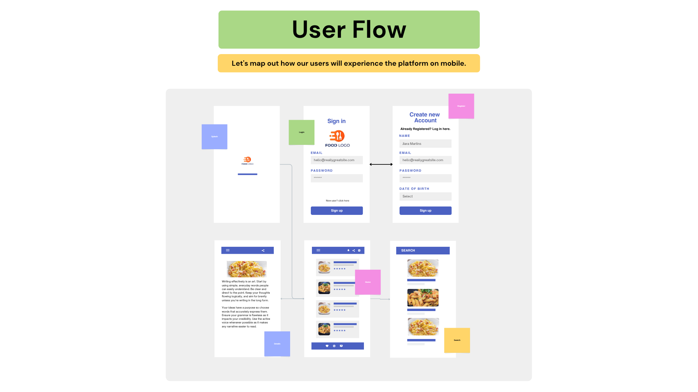

📱 TaskOne Application
A modern Android application built with Kotlin, Jetpack Compose, Room Database, and MVVM architecture.

✨ Features
✅ Splash Screen

✅ Login & Register Screens

✅ Home Screen with Toolbar and Bottom Navigation

✅ Profile and Settings Screens

✅ Reusable UI Components (KButton, KTextField, KImage)

✅ ViewModel-based State Management

✅ Room Database for local data persistence

✅ Navigation with Jetpack Compose

🛠️ Tech Stack

* Technology Purpose
* Kotlin Programming language
* Jetpack Compose UI toolkit for modern Android UI
* MVVM Architecture Clean architecture & separation of concerns
* Room Database Local persistence
* Navigation Compose In-app navigation
* Hilt / Koin (Optional)    Dependency Injection
* Material 3 Design components

📂 Project Structure
com.yourappname
├── data/
│   ├── local/             # Room DB: DAO, Entities
│   ├── model/             # Data models
│   └── repository/        # Repository pattern
├── di/                    # Dependency Injection setup
├── network/               # Network layer (future use)
├── theme/                 # Jetpack Compose themes
├── ui/
│   ├── screens/           # All app screens
│   ├── components/        # KButton, KTextField, etc.
│   └── navigation/        # Navigation graph
├── viewmodel/             # ViewModels per screen
├── utils/                 # Utility classes, constants
└── MainActivity.kt        # App entry point
🚀 Getting Started
Prerequisites
Android Studio (Hedgehog or newer recommended)

1. Kotlin 1.9+
2. Gradle 8.x

Setup Instructions
Clone this repository:
git clone https://github.com/codebyyosry/TaskOne
Open the project in Android Studio.

Sync Gradle and Run the app:
./gradlew build

🧰 Useful Commands
Command	Description
./gradlew build	Builds the project
./gradlew clean	Cleans the build directory
./gradlew test	Runs unit tests

📝 License
This project is licensed under the MIT License. See the LICENSE file for details.

🙌 Acknowledgments
Jetpack Compose

* Room Database

* Material Design

* Retrofit

* Navigation Compose

* Dependency Injection Hilt

## 🖼️ Screenshots

### User Flow:

